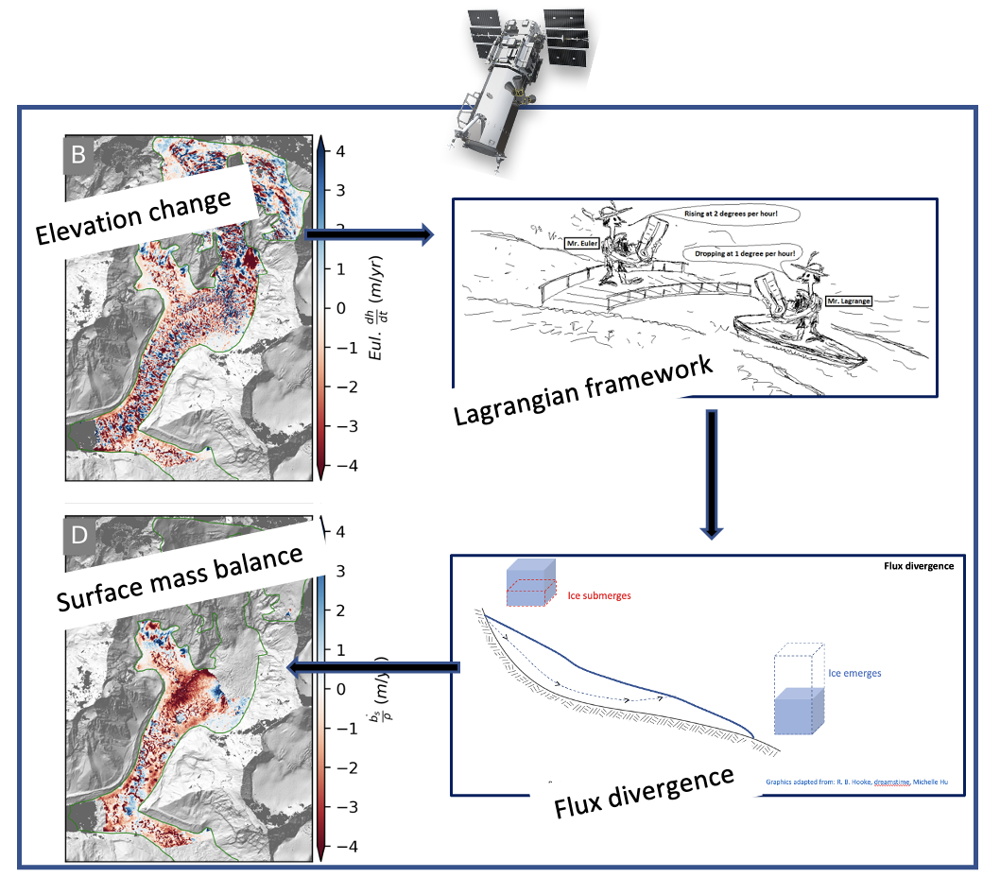

# debris_cover_smb
Tools and notebooks for computing Surface Mass Balance (SMB) over debris-covered glaciers from remote sensing products

Figure 1: Schematic of steps to compute Lagrangian Surface Mass Balance from DEM differencing. Eulerian/Lagrangian graphics are copyright [flowillustrator](www.flowillustrator.com). WorldView satellite logo are copyright [Maxar](https://www.maxar.com/).

## Table of contents
* Functions Library
  * [glac_dyn.py](/debris_cover_smb/glac_dyn.py): functions for flow correction, mass balance computation, and statistics computation
  * [constants.py](/debris_cover_smb/constants.py): commonly used variables and data management
  * [geospatial.py](/debris_cover_smb/geospatial.py): basic geospatial functions
* Scripts
  * [compute_glacier_smb.py](/scripts/compute_glacier_smb.py): Wrapper script to compute SMB from DEMs and velocity maps
  * [disp_mgm_corr.py](/scripts/disp_mgm_corr.py): Wrapper script to compute velocity maps from pairs of shaded relief maps

* Analysis Notebooks
  * [download_supporting_data.ipynb](/notebooks/analysis/download_supporting_data.ipynb): Utilities to download ancillary data (e.g., ice thickness, debris thickness) 
  * [icethickness_sensitivity.ipynb](/notebooks/analysis/icethickness_sensitivity.ipynb): Assess flux divergence sensitivity due to ice thickness
  * [Cliff_sensitivity_analysis.ipynb](/notebooks/analysis/Cliff_sensitivity_analysis.ipynb): Confusion matrix analysis for ice cliffs maps, Black Changri Nup Glacier
  * [propagate_uncertainty_upgraded_formula.ipynb](/notebooks/analysis/propagate_uncertainty_upgraded_formula.ipynb): Uncertainty estimation and uncertainty figure generation
  * [Glacier_description_table.ipynb](/notebooks/analysis/Glacier_description_table.ipynb): Compile statistics for the study sites glacier stats table
  * [Vel_DhDt_uncertainty.ipynb](/notebooks/analysis/Vel_DhDt_uncertainty.ipynb): Uncertainty estimates for velocity and Lagrangian DhDt products
  * [Flux_check.ipynb](/notebooks/analysis/Flux_check.ipynb): Verify volume conservation before and after application of adaptive Gaussian filtering
  * [ChangriNup_annual_paper.ipynb](/notebooks/analysis/ChangriNup_annual_paper.ipynb): Black Changri Nup Annual SMB estimation
  * [Hugonnet_et_al_contribution_by_hma.ipynb](/notebooks/analysis/Hugonnet_et_al_contribution_by_hma.ipynb): Contribution by HMA glaciers to SLR from Hugonnet et al. 2021 used for introduction section in the current study
* Figure Notebooks
  * [SMB_maps.ipynb](/notebooks/figures/SMB_maps.ipynb): Multi-panel SMB maps
  * [SMB_profile.ipynb](/notebooks/figures/SMB_profile.ipynb): Supplementary SMB profile figure
  * [StudyArea.ipynb](/notebooks/figures/StudyArea.ipynb): Panels for study area figure
  * [adaptive_filter_figure.ipynb](/notebooks/figures/adaptive_filter_figure.ipynb): Adaptive filter illustration figure
  * [changrinup_seasonal.ipynb](notebooks/figures/changrinup_seasonal.ipynb): Black Changri Nup seasonal maps
  * [imja_zoomin_highres.ipynb](/notebooks/figures/imja_zoomin_highres.ipynb): Zoom-in panels for Imja Glacier
  * [khumbu_zoomin_highres.ipynb](/notebooks/figures/khumbu_zoomin_highres.ipynb): Zoom-in panels for Khumbu Glacier
  * [summary_figure.ipynb](/notebooks/figures/summary_figure.ipynb): Ice cliff summary figure
  * [lirung_ts.ipynb](/notebooks/figures/lirung_ts.ipynb): Lirung Glacier seasonal time series
* Processing Notebooks
  * [velocity_cleanup](https://github.com/uw-cryo/debris_cover_smb/tree/main/notebooks/processing/velocity_cleanup): Notebooks to remove velocity anomaly and fill gaps using Gaussian filters

  
* [Document to produce SMB maps step by step](/Reproduce_workflow.md)

## Contact us
If you would like to use the tools for applying Lagrangian elevation change to your study site, please feel free to reach out to Shashank Bhushan (sbaglapl@uw.edu) :D 

## Citation
The code in this repository was developed for the under-review manuscript: 
* Bhushan S., Shean D., Hu J. M., Rounce D., Guillet G. (under-review): Deriving seasonal and annual surface mass balance for debris-covered glaciers in Central Himalaya from flow-corrected satellite stereo DEM time series. 

