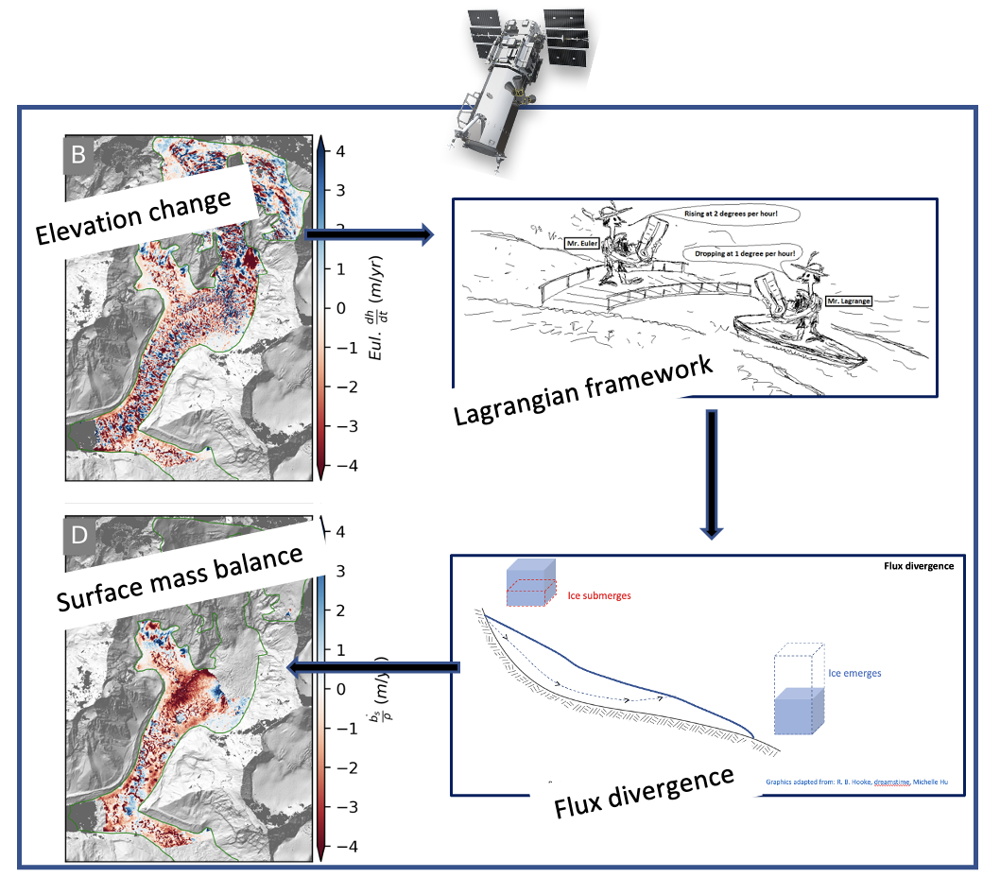

# debris_cover_smb
Tools and notebooks for computing Surface Mass Balance (SMB) over debris-covered glaciers from remote sensing products

Figure 1: Schematic of steps to compute Surface Mass Balance from DEM differencing.Eulerian/Lagrangian graphics are used from:. Digitalglobe satellite logo are used from: .
